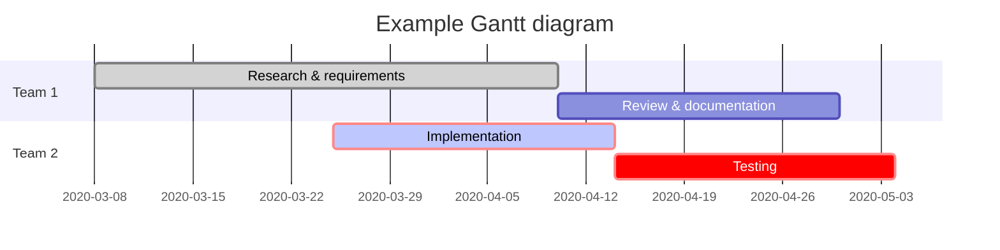
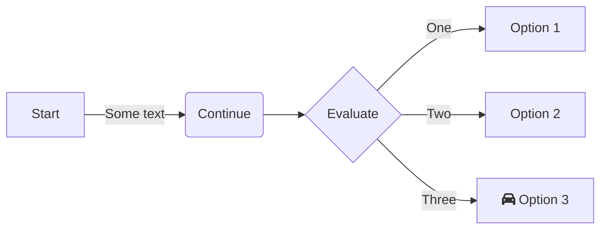

---
You might have figured from my previous blog posts that I am particularly interested in documentation.

I firmly believe that it is a very important aspect of our job as it can greatly enhance our understanding about a certain project, its purpose and generally all the shenanigans that come with it.

The cherry on the pie when it comes to documentation are diagrams that visually communicate certain details.

After all, we all know that one picture is worth a thousand words!

Flowcharts, Class diagrams and Architectural diagrams are almost always superior to raw text and fun to read.

## Mermaid.js
During the past years, my go to place to create diagrams was [draw.io](https://app.diagrams.net/).

Given that it is very versatile and of course free, it holds a special place in my heart!

However, I recently stumbled across [Mermaid.js](https://mermaid.js.org/).

Mermaid is a javaScript based diagramming and charting tool that renders Markdown text definitions to create and modify diagrams dynamically.

What this means is that you can render diagrams using Markdown instead of manually drawing shapes on a canvas.

Now, obviously, it doesn't support the degree of customization that a traditional free drawing tool would, however, 80% of the times it will be more than enough.

And this is not something negative since it forces consistency in your diagrams due to the standardized way of the Markdown syntax.

## Drawing a diagram
Drawing a diagram with Marmaid.js is fairly simple.

For example, adding the syntax below in a Markdown file will render a [Gantt](https://en.wikipedia.org/wiki/Gantt_chart) diagram.

```
gantt
 title Example Gantt diagram
    dateFormat  YYYY-MM-DD
    section Team 1
    Research & requirements :done, a1, 2020-03-08, 2020-04-10
    Review & documentation : after a1, 20d
    section Team 2
    Implementation      :crit, active, 2020-03-25  , 20d
    Testing      :crit, 20d
```



Whereas, the following syntax will render a [Flowchart](https://en.wikipedia.org/wiki/Flowchart).

```
flowchart LR
  A[Start] --Some text--> B(Continue)
  B --> C{Evaluate}
  C -- One --> D[Option 1]
  C -- Two --> E[Option 2]
  C -- Three --> F[fa:fa-car Option 3]
```



## Integration
Any tool that integrates with Mermaid.js will be able to render your Markdown to diagrams seamlessly.

There is a variety of tools such as Github, Azure and multiple Atlassian products which you can explore in more detail [here](https://mermaid.js.org/ecosystem/integrations-community.html).

Even my personal website which is built on top of [Jekyll](https://jekyllrb.com/) using the [Chirpy](https://chirpy.cotes.page/) template is able to render Mermaid.js, which is of course the reason you can view the diagrams above.

## Playground
The Mermaid team has also kindly provided a [Playground](https://www.mermaidchart.com/play) where you can test and preview your diagrams before committing them.

There are also other options, such as using the [Mermaid Preview](https://marketplace.visualstudio.com/items?itemName=vstirbu.vscode-mermaid-preview) plugin in VSCode, or simply creating and previewing a new file in your Github repository.

## Example diagrams
The Mermaid [documentation](https://mermaid.js.org/intro/) has a plethora of examples to get you started.

You can also jump straight to the [Playground Editor](https://www.mermaidchart.com/play#pako:eNqrVkrOT0lVslJSqgUAFW4DVg) and select one of the existing templates to start experimenting.

[Christopher Allen](https://gist.github.com/ChristopherA) has also created a bunch of examples in his personal repository [here](https://gist.github.com/ChristopherA/bffddfdf7b1502215e44cec9fb766dfd), which I found really useful.

## Conclusion
Markdown diagrams may not offer such flexibility as the traditional free drawing tools, however they can be great for a number of reasons:

- They are consistent
- They are fast to draw
- They can be produced dynamically
- They are supported by tons of tools
- And... they can save you the hustle of aligning your components!

Thus, if you think they can be that cherry in your pie, go ahead and experiment with Mermaid. You will love it!
